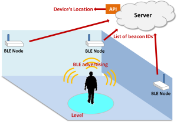
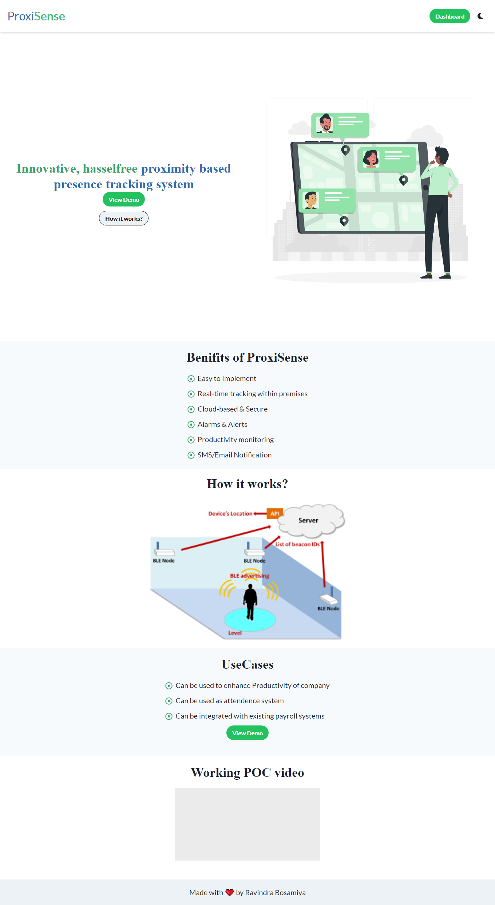
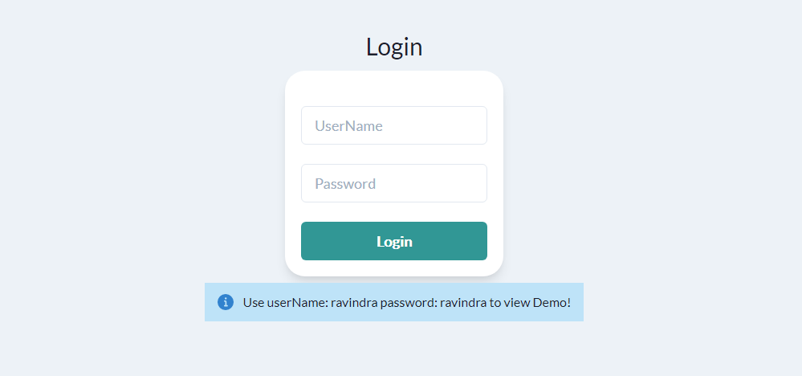
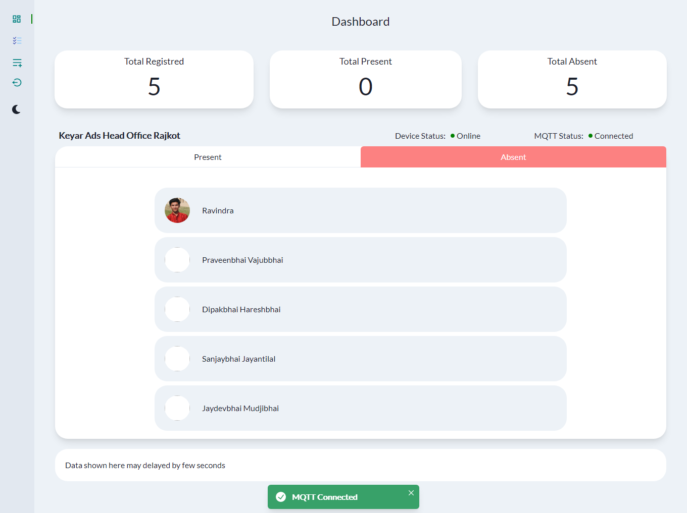
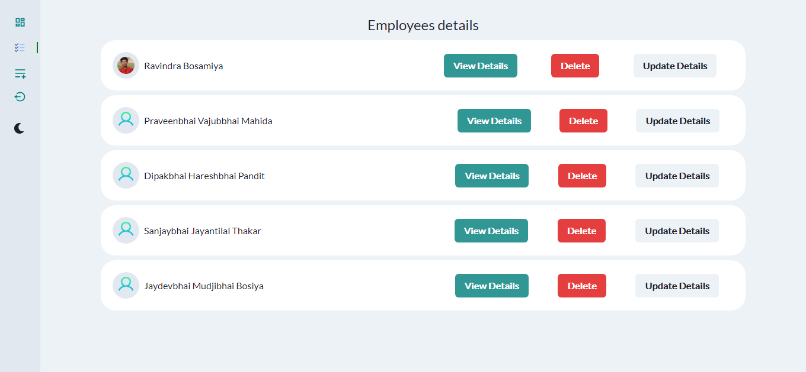
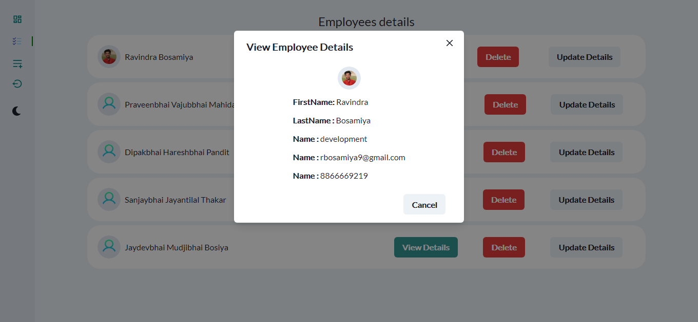
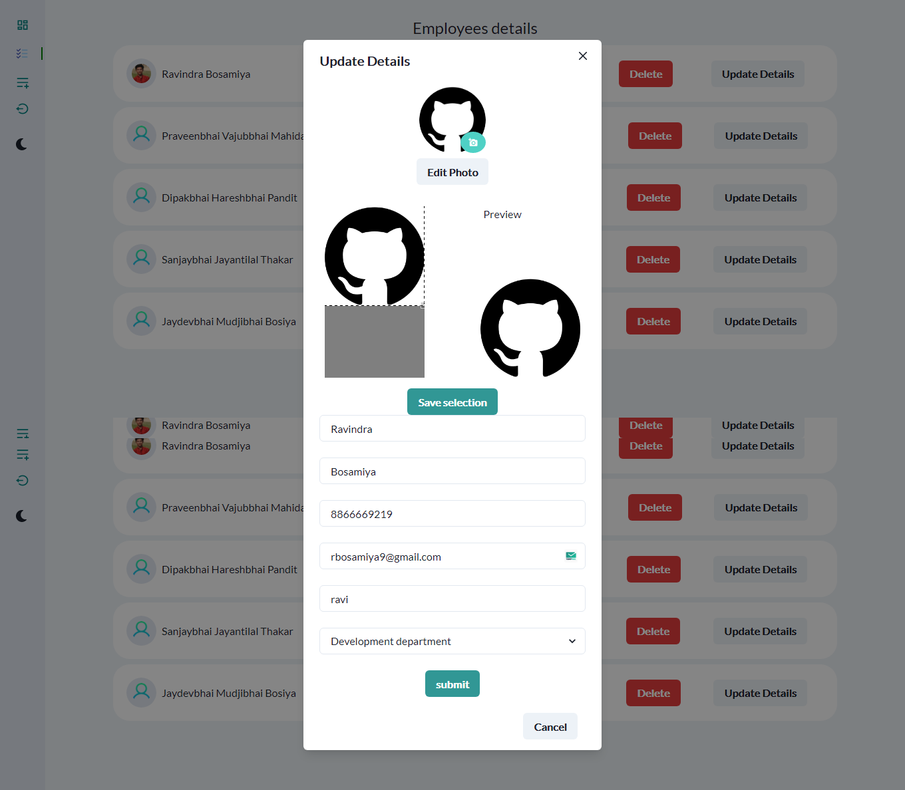
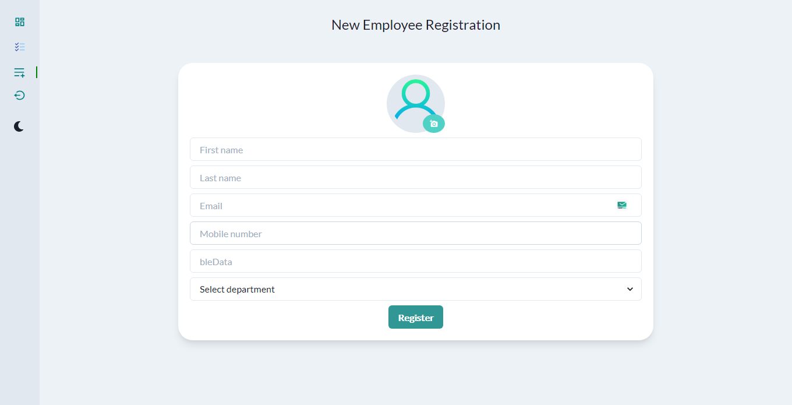
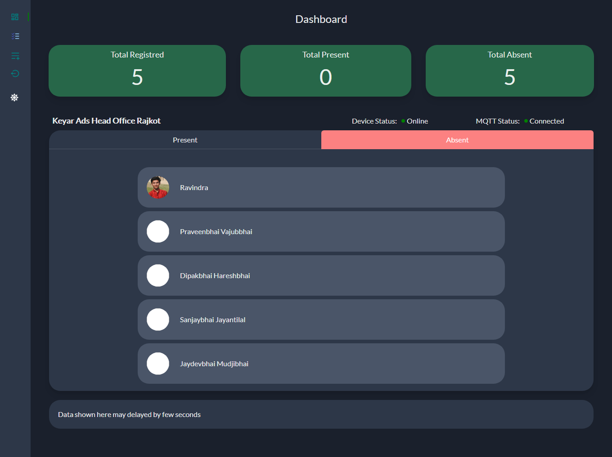
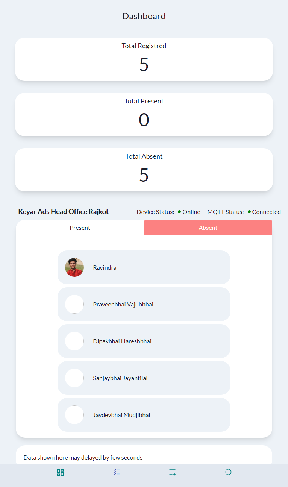

# ProxiSense

A proximity based smart attendence system.
 
<a href="https://proxisense.ravindrabosamiya.tech/">
<button> View demo</button></a>

## Problem

Now a days in every office and workplace fingureprint based attendence system and face detection based attendence system is used, the biggest drawback of such systems is employees roam outside the workplace after punching in the fingureprint / face detection system.

Cumulatively such small unusual breaks leads to large
loss of working hours of a company.

## Working concept

Proxisense is a complete solution which works on concept of Bluetooth Low energy (BLE) advertising.
 

## Modules

1. Hardware  
   ProxiSense hardware is a device responsible for scanning nearby BLE advertisement packects and sending data to the webapp via MQTT.

2. Mobile app  
   Currently we have made mobile app which works on android platform and which creates BLE advertisement which further scanned by ProxiSense hardware.

3. Web app  
   ProxiSense web app is main dashboard where administrator can add update delete the user and can also view employees present in primises in realtime.

### Tech

- Hardware  
  ESP32, MQTT

- Mobile app  
  BLE advertisement

- Web app  
  Reactjs , firebase, heroku (for api)

## Benifits

- Time saved - money saved
- Increased productivity of employees
- Reduces error in payroll

## Web app Features

- Audio notification when employees enter or leave premises
- Add / update / delete employees
- update employee photo (selection based)
- Responsive design
- Dark mode

## ScreenShots

Homepage

Login page

Dashboard

View all employees

viewEmployeeDetails

editEmployeePhoto

createEmployee

//9687870897

Dashboard in dark Mode

 Dashboard in mobile view 

